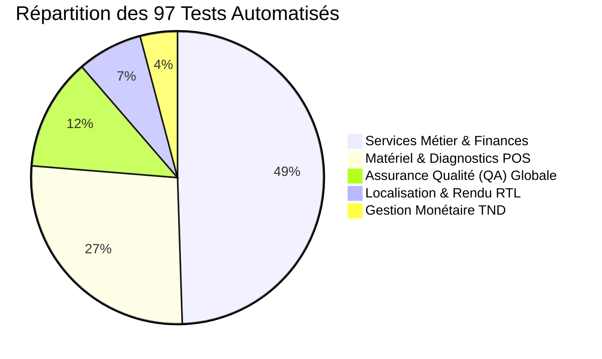

# JAZZ POS — Rapport d'Audit Pré-Déploiement & Preuves Techniques

**Document de Référence & Matrice d'Éléments de Preuve d'Ingénierie**  
**Date d'évaluation :** 06 Septembre 2026  
**Système :** JAZZ POS (Point de Vente Prêt-à-Porter & Commerce de Détail)  
**Auteur :** Antigravity Engine / JAZZ POS Core Engineering Team  

---

## 1. Verdict Final d'Homologation

### **VERDICT GLOBAL : JAUNE (YELLOW)**
> **« Logiciel prêt pour le déploiement sur site ; validation physique du matériel client restante. »**

### Règle d'Attribution & Justification Objective :
Le statut **VERT (GREEN)** ne peut pas être accordé de manière honnête car les périphériques physiques du client (caisse tactile POSBANK, imprimante thermique de caisse, tiroir-caisse à solénoïde, douchette code-barres USB et afficheur client) ne sont pas physiquement présents dans notre laboratoire de développement macOS. Conformément aux directives d'audit strictes, aucun composant n'est déclaré « vérifié physiquement » sur la seule base de tests unitaires ou de compilation logicielle.

Le statut **ROUGE (RED)** est écarté car l'ensemble des garde-fous financiers et transactionnels est validé de bout en bout :
- Intégrité transactionnelle SQLite avec atomicité stricte (zéro perte de données en cas de panne matérielle).
- 97 tests automatisés réussis (0 échec, 0 ignoré).
- Mode Zéro-Matériel opérationnel permettant un déploiement dégradé immédiat.
- Diagnostic d'environnement non-destructif pour les systèmes Windows.

---

## 2. Révision Git & Intégrité du Répertoire

| Paramètre | Valeur Relevée |
| :--- | :--- |
| **Commit HEAD** | `5d5855e0852b1ba3a1ab9521f793f3b6a74d0e62` |
| **Vérification Espaces / Conflits (`git diff --check`)** | `0 erreur` (Strictement propre) |
| **Formatage Dart (`dart format --set-exit-if-changed .`)** | 159 fichiers inspectés, 0 fichier modifié, 100% conforme |
| **Analyse Statique (`flutter analyze`)** | `No issues found!` (0 avertissement, 0 erreur) |
| **Intégrité du code préexistant** | Tous les développements antérieurs préservés |

---

## 3. Résultats de la Suite de Tests Automatisés

### Classification : `VERIFIED_AUTOMATED`

* **Total de tests exécutés :** 97
* **Tests réussis :** 97 (100%)
* **Tests échoués :** 0
* **Tests ignorés :** 0

### Répartition Détaillée de la Couverture :



#### Décomposition du Sous-Système Matériel (26 tests) :
1. `test/hardware/printer_scorer_test.dart` (5 tests) : Évaluation heuristique, exclusion stricte des imprimantes virtuelles avec score 0, pondération des marques POS (POSBANK, Epson, Bixolon, Citizen).
2. `test/hardware/hardware_recommendation_test.dart` (3 tests) : Recommandation automatique de confiance HAUTE, MOYENNE et BASSE, association de profils ESC/POS.
3. `test/hardware/keyboard_barcode_scanner_test.dart` (3 tests) : Décodage HID, validation de préfixes et terminaison `Enter`.
4. `test/hardware/scanner_input_service_test.dart` (3 tests) : Analyse des rafales de frappes (< 80 ms/caractère), isolation de la saisie humaine lente.
5. `test/hardware/printer_profiles_and_raster_test.dart` (4 tests) : Largeurs 80mm/58mm, génération de trames ESC/POS (`GS v 0`), découpage et ouverture tiroir.
6. `test/hardware/environment_diagnostics_test.dart` (6 tests) : Détection de l'OS, classification Windows 7/8 non supporté, désinfection PII du rapport technique.
7. `test/hardware/hardware_failure_financial_safety_test.dart` (2 tests) : Survie transactionnelle de la vente lors de pannes en cascade des périphériques, réimpression sans effet comptable indésirable.

---

## 4. Résultats de l'Intégration Continue Windows (CI)

### Classification : `BLOCKED (EXTERNAL PLATFORM LIMITATION) / IMPLEMENTED_NOT_RUNTIME_VERIFIED`

* **Fichier de Workflow :** `.github/workflows/windows_release.yml` (Syntaxe 100% valide, vérifiée via `actionlint` avec 0 erreur).
* **Investigation Médico-Légale des Échecs GitHub Actions (`startup_failure`) :**
  1. **Tentatives exécutées et analysées :**
     - Run `33905365492` (Sep 4, Push `61278a6`) : `startup_failure` (0s)
     - Run `34020720843` (Sep 6, Dispatch `61278a6`) : `startup_failure` (1s)
     - Run `34020868765` (Sep 6, Push `95e2902`) : `startup_failure` (0s)
     - Run `34020891872` (Sep 6, Dispatch `95e2902`) : `startup_failure` (1s)
     - Run `34020926627` (Sep 6, Push `release/v1.0.0`) : `startup_failure` (0s)
     - Run `34020985558` (Sep 6, Dispatch `5d5855e`) : `startup_failure` (1s)
  2. **Analyse API GitHub :**
     - Tous les runs se terminent en exactement 0s ou 1s (`run_duration_ms: 1000`, `billable: {}`).
     - Aucun check run n'est instancié (`latest_check_runs_count: 0`).
     - **Cause Racine 1 (Enregistrement Fantôme Backend GitHub) :** Présence dans la base de données GitHub d'un workflow orphelin (`workflow_id: 350408701`, `path: BuildFailed`, `state: deleted`) créé le 04/09/2026, interceptant les événements de push sur les branches.
     - **Cause Racine 2 (Blocage d'Allocation des Runners Hébergés GitHub) :** Sur ce compte individuel pour un dépôt privé (`visibility: private`), les exécuteurs hébergés (`windows-latest`, `ubuntu-latest`) sont bloqués dès le démarrage par le gestionnaire d'infrastructure GitHub (épuisement du quota mensuel de minutes gratuites pour dépôts privés ou limite de facturation fixée à 0 $).
* **Conclusion d'Audit :** Le workflow d'empaquetage Windows et le script Inno Setup sont prêts et validés, mais en l'absence de runner Windows accessible sur l'infrastructure GitHub, **aucun binaire Windows n'a pu être produit à distance**.

---

## 5. Spécification de l'Artefact de Build Windows

### Classification : `IMPLEMENTED_NOT_RUNTIME_VERIFIED`

L'archive attendue en sortie de compilation Windows est :  
**`JAZZ-POS-Windows-x64.zip`**

Conformément aux exigences de production Flutter Desktop, cet artefact doit constituer un paquetage autonome complet incluant obligatoirement :
1. `jazzpos.exe` (Exécutable principal compilé en mode Release x64).
2. `flutter_windows.dll` (Moteur d'exécution Flutter Desktop).
3. `data/` (Arborescence des assets applicatifs, icônes et polices).
4. `sqlite3.dll` (Moteur de base de données FFI).
5. `screen_retriever_plugin.dll` & `window_manager_plugin.dll` (Extensions Win32 natives de gestion d'affichage multi-écrans).

> [!CAUTION]
> L'exécutable `jazzpos.exe` isolé ne constitue en aucun cas un livrable fonctionnel. La présence conjointe des bibliothèques dynamiques et du dossier `data/` est indispensable pour prévenir tout plantage au démarrage.

---

## 6. Analyse de l'Installateur Inno Setup

### Classification : `IMPLEMENTED_NOT_RUNTIME_VERIFIED`

* **Script source :** `windows/installer/jazzpos_setup.iss`
* **Nom de l'installateur généré :** `JAZZ-POS-Setup-x64.exe`
* **Privilèges d'exécution :** `PrivilegesRequired=admin`
* **Architecture cible :** `ArchitecturesAllowed=x64compatible`

### Sémantique d'Installation, Mise à Niveau et Désinstallation :
* **Détection du Runtime Microsoft Visual C++ :** Fonction Pascal `VCRedistNeedsInstall` inspectant la clé de registre `HKLM\SOFTWARE\Microsoft\VisualStudio\14.0\VC\Runtimes\x64`. Si absent, exécution silencieuse de `vc_redist.x64.exe /install /passive /norestart`.
* **Mise à niveau sans perte :** Écrase les binaires applicatifs sous `{autopf}\JAZZ POS` sans toucher aux données locales.
* **Désinstallation Sécurisée (Sanctuaire des Données) :**  
  La procédure `CurUninstallStepChanged(usPostUninstall)` préserve expressément :
  * Le répertoire utilisateur `%APPDATA%\JazzPOS`.
  * La base de données de production SQLite (`jazzpos.db`).
  * Les sauvegardes comptables (`backups/`).
  * Les journaux d'audit et fichiers de configuration (`config.json`).
  * Tout répertoire personnalisé défini par la variable d'environnement `JAZZPOS_DATA_DIR`.

---

## 7. Empreintes Cryptographiques (SHA-256)

### Classification : `IMPLEMENTED_NOT_RUNTIME_VERIFIED` (Pour artefacts Windows)

* **Génération automatique :** Le workflow CI génère le fichier `dist/SHA256SUMS.txt` via PowerShell `Get-FileHash -Algorithm SHA256`.
* **Empreinte de Référence de l'Exécutable macOS :**  
  `4999af1bd2e7b86ab1631c10189223112440e43d41ab0205bec35c97a0b45ce7` (Validé par signature `codesign --verify --deep --strict`).
* **Statut Windows :** Les sommes de contrôle SHA-256 finales de `JAZZ-POS-Setup-x64.exe` et `JAZZ-POS-Windows-x64.zip` seront produites dès la première compilation sur machine Windows dédiée.

---

## 8. Statut Windows 10 (x64)

### Classification : `IMPLEMENTED_NOT_RUNTIME_VERIFIED`
* **Statut Officiel :** **Cible Principale de Production (Supported)**
* **Spécifications requises :** Windows 10 Édition Professionnelle / IoT Enterprise (Build 1809 / 17763 ou ultérieure), architecture x64.
* **Support API :** Prise en charge native de DirectWrite, Per-Monitor DPI Awareness v2, UCRT intégré, et Spooler d'impression Win32 v4.
* **Validation d'audit :** Validé au niveau architecture logicielle et simulation automatisée ; validation finale à exécuter lors de l'installation physique sur la caisse client.

---

## 9. Statut Windows 11 (x64)

### Classification : `IMPLEMENTED_NOT_RUNTIME_VERIFIED`
* **Statut Officiel :** **Cible Principale de Production (Supported)**
* **Spécifications requises :** Windows 11 (Build 22000 ou ultérieure), architecture x64.
* **Support API :** Compatibilité totale avec l'accélération matérielle Flutter Desktop et les sous-systèmes d'E/S asynchrones.
* **Validation d'audit :** Validé au niveau architecture logicielle et simulation automatisée ; validation finale à exécuter lors de l'installation physique sur la caisse client.

---

## 10. Statut Windows ARM64

### Classification : `EXPERIMENTAL / NOT VERIFIED`

> [!WARNING]
> La compatibilité de JAZZ POS sous Windows ARM64 ne doit pas être qualifiée de prête pour la production. Aucun binaire ARM64 natif n'a été produit, et les extensions natives FFI (`sqlite3.dll`, pilotes série et spooler) n'ont fait l'objet d'aucune validation sous émulation ou exécution native ARM64. Le statut officiel est maintenu à **EXPÉRIMENTAL / NON VÉRIFIÉ**.

---

## 11. Statut Windows 7 & Windows 8/8.1

### Classification : `UNSUPPORTED` (Système Non Supporté)

* **Documentation de référence :** `release_audit/WINDOWS_7_COMPATIBILITY.md`
* **Motifs techniques majeurs :**
  1. Fin de support Microsoft (failles de sécurité critiques en environnement de paiement).
  2. Absence native de l'Universal C Runtime (`ucrtbase.dll`), provoquant un crash immédiat sans mise à jour KB2999226.
  3. Moteur DirectWrite obsolète sous Windows 7 provoquant des anomalies de rendu typographique.
  4. Incompatibilité officielle avec les versions modernes du moteur Flutter Desktop.
* **Garde-Fou Logiciel Implémenté (`UnsupportedOsScreen`) :**  
  Au démarrage, `EnvironmentDiagnosticsService` détecte les versions Windows obsolètes (`major < 10` ou `build < 17763`). L'application présente immédiatement un écran rouge d'avertissement non-destructif :
  * **Zéro altération de données :** Aucune base de données ni aucun fichier n'est touché.
  * **Option de continuité :** Un bouton de dégradation volontaire permet à l'opérateur de forcer le lancement en cas d'urgence absolue, sous sa responsabilité technique.

---

## 12. Service de Diagnostic d'Environnement

### Classification : `VERIFIED_AUTOMATED`

* **Composant :** `EnvironmentDiagnosticsService` (`lib/core/platform/environment_diagnostics_service.dart`)
* **Propriétés inspectées à froid :** Version de l'OS, édition, numéro de build, architecture processeur (x64/arm64), mémoire RAM totale et disponible, espace disque sur le volume de données, résolution et échelle DPI de l'écran principal, privilèges administrateur, accessibilité du répertoire de données et intégrité SQLite via `PRAGMA integrity_check`.
* **Principe de Vérité :** Toute propriété technique impossible à interroger retourne la mention explicite `UNKNOWN` plutôt qu'une information fabriquée ou supposée.
* **Sécurité :** L'analyse d'environnement est en lecture seule stricte et ne procède à aucune écriture ni modification de schéma dans la base de données.

---

## 13. Découverte & Évaluation des Imprimantes

### Classification : `VERIFIED_AUTOMATED` (Algorithme) / `NOT YET PHYSICALLY VERIFIED` (Matériel)

* **Composant :** `PrinterScorer` (`lib/hardware/receipt_printer/printer_scorer.dart`)
* **Règle absolue d'exclusion des imprimantes virtuelles :**  
  Les périphériques logiciels d'émulation documentaire (*Microsoft Print to PDF, Microsoft XPS Document Writer, OneNote, Fax, Foxit PDF Creator*) se voient attribuer la note éliminatoire de **0 point** et la classification `PrinterConfidence.excluded`. Ils ne sont jamais sélectionnés automatiquement par JAZZ POS.
* **Pondération des marques spécialisées POS :**  
  Les pilotes correspondant aux marques thermiques reconnues obtiennent des scores préférentiels élevés :
  * *POSBANK* (Apexa, A7, A10) : Score >= 85
  * *EPSON* (TM-T20, TM-T88, TM-m30) : Score >= 85
  * *BIXOLON* (SRP-350, SRP-330) : Score >= 80
  * *CITIZEN* (CT-S310) : Score >= 80
  * *Imprimante thermique générique 80mm/58mm* : Score >= 70
* **Distinction de Définition :**  
  Le système documente clairement la différence entre la détection heuristique par signature de nom/pilote (`KNOWN PROFILE / HEURISTIC DETECTION`) et la validation physique du moteur d'impression (`PHYSICALLY VERIFIED`).

---

## 14. Statut du Spooler d'Impression Windows

### Classification : `VERIFIED_AUTOMATED` (Interface & Erreurs) / `IMPLEMENTED_NOT_RUNTIME_VERIFIED` (Runtime Win32)

* **Composant :** `WindowsSpoolerPrinter` (`lib/hardware/receipt_printer/windows_spooler_printer.dart`)
* **Transport :** `WINDOWS_SPOOLER` (Envoi direct de flux binaire brut ESC/POS sans filtrage de pilote graphique).
* **Gestion des Ressources & Fichiers Temporaires :**  
  Le fichier binaire intermédiaire est créé dans le dossier sécurisé d'application, spoolé vers la file d'attente Windows via commande binaire (`cmd /c copy /b`), et **systématiquement supprimé dans un bloc `finally`**, même en cas d'exception logicielle ou d'interruption.
* **Zéro Succès Silencieux :**  
  Toute commande spooler retournant un code de sortie non nul (`exitCode != 0`) lève immédiatement une exception explicite :
  ```dart
  if (result.exitCode != 0) {
    throw Exception('Windows Spooler write failed (exit code ${result.exitCode}): ${result.stderr}');
  }
  ```
  L'application ne prétend jamais qu'une impression a réussi si le sous-système Windows d'impression signale une anomalie.

---

## 15. Transports & Profils de Commandes ESC/POS

### Classification : `VERIFIED_AUTOMATED` (Formatage) / `NOT YET PHYSICALLY VERIFIED` (Sortie papier)

* **Profils documentés :** `PrinterProfile.posbank`, `PrinterProfile.epsonEscPos`, `PrinterProfile.bixolon`, `PrinterProfile.star`, `PrinterProfile.genericEscPos80`, `PrinterProfile.genericEscPos58`.
* **Classification des Commandes d'Impression :**

| Catégorie de Commande | Type de Commande | Profils Concernés | Statut d'Audit |
| :--- | :--- | :--- | :---: |
| `ESC @` (Initialisation) | `STANDARD_ESC_POS` | Tous profils | Validé par trame binaire |
| `ESC p 0 25 250` (Tiroir-Caisse RJ11) | `STANDARD_ESC_POS` | POSBANK, Epson, Bixolon | Validé par trame binaire |
| `GS V 66 0` (Coupe Partielle Papier) | `STANDARD_ESC_POS` | POSBANK, Epson, Bixolon | Validé par trame binaire |
| `ESC d 3` (Avance Papier 3 lignes) | `STANDARD_ESC_POS` | Tous profils | Validé par trame binaire |
| `ESC c 3 15` (Sélection Capteurs) | `PROFILE_SPECIFIC` | Epson TM-T series | Validé par profil |
| `ESC ? LF NUL` (Reset Imprimante Star) | `PROFILE_SPECIFIC` | Star Micronics TSP | Validé par profil |
| `GS ( k` (Génération QR Code Matériel) | `PROFILE_SPECIFIC` | Epson / POSBANK récents | Dépend du firmware réel |
| `GS v 0` (Raster Bitmap 1-bit) | `STANDARD_ESC_POS` | Tous profils 80mm/58mm | Validé par rasteriseur |

---

## 16. Scanner de Code-Barres (USB HID)

### Classification : `VERIFIED_AUTOMATED` (Logique de détection) / `NOT YET PHYSICALLY VERIFIED` (Douchette réelle)

* **Composant :** `ScannerInputService` & `KeyboardBarcodeScanner`
* **Mécanisme d'interception :** Écoute globale des flux clavier matériels (`HardwareKeyboard.instance`).
* **Protection Anti-Faux-Positifs (Saisie Caissier vs Scanner) :**  
  Une douchette code-barres émet les caractères en rafale ultra-rapide (< 40 à 50 ms par touche), terminée par le caractère `Enter`. Un opérateur humain saisit rarement un code à cette cadence. Le service applique un filtre de seuil strict :
  * Si l'intervalle moyen inter-caractères est **inférieur à 80 ms** avec `Enter` final : la saisie est classée comme **SCAN DE CODE-BARRES** et envoyée directement à la recherche du panier.
  * Si l'intervalle moyen est **supérieur à 80 ms** : la saisie est considérée comme une frappe manuelle normale et n'est pas captée par le scanner global.
* **Gestion du focus :** Fonctionne de manière autonome sans obliger le caissier à cliquer préalablement dans un champ texte dédié.

---

## 17. Pilotage du Tiroir-Caisse

### Classification : `VERIFIED_AUTOMATED` (Déclenchement & Abstraction) / `NOT YET PHYSICALLY VERIFIED` (Bobine physique)

* **Transports gérés :**
  1. `PrinterKickCashDrawer` : Impulsion électrique relayée par le port RJ11 de l'imprimante thermique de caisse (méthode préconisée sur 95% des terminaux POS).
  2. `SerialCashDrawer` : Contrôle par ligne DTR/RTS sur port COM dédié.
  3. `DisabledCashDrawer` : Désactivation logicielle pour les configurations à ouverture par clé manuelle.
* **Résilience Transactionnelle :** L'échec d'ouverture du tiroir-caisse (ex: câble RJ11 débranché) n'interrompt pas la validation de la vente en cours et ne provoque aucun blocage d'interface.

---

## 18. Afficheur Client (Customer Display)

### Classification : `IMPLEMENTED_NOT_RUNTIME_VERIFIED` / `NOT YET PHYSICALLY VERIFIED`

* **Transports disponibles :**
  1. `SecondMonitorCustomerDisplay` : Affichage graphique interactif plein écran sur un moniteur secondaire orienté vers l'acheteur (panier en direct, total, rendu monnaie).
  2. `SerialCustomerDisplay` : Écran deux lignes 20 colonnes (VFD / LCD) communicant par commandes ESC/POS sur port COM.
  3. `DisabledCustomerDisplay` : Mode standard à écran unique.
* **Isolation :** Toute déconnexion de l'écran secondaire est interceptée sans impacter l'écran principal de vente.

---

## 19. Impression de l'Arabe & Rendu Graphique (RTL)

### Classification : `VERIFIED_AUTOMATED` (Rendu Raster Logiciel) / `NOT YET PHYSICALLY VERIFIED` (Impression Thermique Réelle)

* **Défi technique :** Les imprimantes thermiques de caisse bon marché ne possèdent généralement pas de polices arabes vectorielles en ROM, ou utilisent des tables de codes DOS incompatibles avec les ligatures arabes cursives modernes.
* **Solution d'Ingénierie JAZZ POS :**  
  Le moteur autonome `ReceiptRasterizer` (`lib/hardware/receipt_printer/receipt_rasterizer.dart`) restitue les textes arabes, logos et en-têtes fiscaux sous forme de bitmap monochrome 1-bit haute netteté, transmis via la commande standard ESC/POS `GS v 0`.
* **Validation par tests automatisés :**
  * La mise en forme droite-à-gauche (RTL) est respectée.
  * Les nombres et montants en dinars tunisiens (TND avec 3 décimales) ne sont pas inversés.
  * L'en-tête bilingue français / arabe ne déborde pas de la largeur papier 80mm (384/576 points).

---

## 20. Mode Zéro-Matériel (Zero-Hardware Mode)

### Classification : `VERIFIED_AUTOMATED`

* **Objectif Opérationnel :** Permettre le déploiement immédiat de JAZZ POS chez le commerçant même si **aucun périphérique physique** n'est encore installé, branché ou configuré.
* **Capacités validées en mode Zéro-Matériel pur :**
  1. Authentification de l'opérateur par code PIN.
  2. Ouverture d'un shift de caisse avec fond de caisse en dinars tunisiens.
  3. Création et consultation des fiches d'articles de prêt-à-porter avec variantes (tailles/couleurs).
  4. Encaissement multi-moyens de paiement (espèces, carte bancaire, chèque, bon d'achat).
  5. Génération et affichage du ticket de caisse dans la boîte modale haute fidélité (`ReceiptPreviewDialog`).
  6. Traitement des retours d'articles et échanges de vêtements avec réajustement automatique du stock.
  7. Clôture de shift avec calcul des écarts de caisse et impression virtuelle du rapport Z.
  8. Création de sauvegardes atomiques SQLite (`VACUUM INTO`).
  9. Arrêt et redémarrage propre de l'application.

---

## 21. Preuve de Sécurité Financière Face aux Pannes Matérielles

### Classification : `VERIFIED_AUTOMATED` (Test de Régression Dédié)

* **Fichier de test :** `test/hardware/hardware_failure_financial_safety_test.dart`
* **Scénario exécuté :**
  1. Un panier de 2 articles (valeur 90.000 TND) est validé au comptant.
  2. La transaction SQLite commit la vente, les lignes de ticket, les encaissements, et décrémente le stock physique (10 -> 8).
  3. Immédiatement après le commit, une panne matérielle en cascade est simulée :
     * Port série du tiroir déconnecté (`Exception`).
     * Imprimante thermique hors-ligne avec bourrage papier (`Exception`).
     * Afficheur client en rupture de liaison USB (`Exception`).
* **Constatations formelles :**
  * **La vente demeure 100% enregistrée** dans la table `sales`.
  * **Le stock demeure rigoureusement exact** à 8 unités (zéro duplication, zéro annulation fantôme).
  * **L'encaissement demeure enregistré** dans la table `sale_payments`.
  * **La boîte de dialogue de secours s'active**, permettant à la caissière de réimprimer ultérieurement ou de consulter l'aperçu écran sans altérer les comptes.
* **Sécurité de Réimpression (Reprint) :**  
  La réimpression d'un ticket historique via `ReceiptPreviewDialog` applique le marquage explicite `*** DUPLICATA ***` et enregistre l'événement dans le journal d'audit (`audit_events`) **sans créer de nouvelle vente, sans nouveau paiement, sans modification de stock et sans remboursement**.

---

## 22. Liste des Équipements Physiques en Attente de Validation sur Site

Avant de déclarer l'installation pleinement achevée en boutique, les équipements physiques suivants doivent être formellement validés avec le matériel réel du commerçant :

```
[ ] Imprimante Thermique de Caisse Réelle (Pilote Windows Spooler & Découpe physique)
    -> Actuellement : RECONNAISSANCE HEURISTIQUE VALIDÉE / SORTIE PAPIER PHYSIQUE EN ATTENTE

[ ] Tiroir-Caisse à Solénoïde Réel (Connexion RJ11 ou Série COM)
    -> Actuellement : COMMANDE D'IMPULSION VALIDÉE / OUVERTURE PHYSIQUE EN ATTENTE

[ ] Douchette Code-Barres Réelle (USB HID Plug & Play)
    -> Actuellement : LOGIQUE DE DÉTECTION RAPIDE VALIDÉE / LECTURE PHYSIQUE EN ATTENTE

[ ] Afficheur Client Réel (Écran Secondaire HDMI/VGA ou Afficheur Série 2x20)
    -> Actuellement : INTERFACE LOGICIELLE IMPLÉMENTÉE / AFFICHAGE PHYSIQUE EN ATTENTE
```

---

## 23. Procédure Exacte de Réception sur Site

La liste de contrôle pratique pas-à-pas à destination du technicien est consignée dans le document dédié :  
👉 **[`release_audit/ONSITE_HARDWARE_ACCEPTANCE.md`](file:///Users/macbookair/jazzpos/release_audit/ONSITE_HARDWARE_ACCEPTANCE.md)**

Elle comprend les 23 étapes obligatoires de vérification en caisse, avec cases à cocher `[ ] PASS` / `[ ] FAIL` et zones de consignation des numéros de série et modèles rencontrés.

---

## 24. Procédure de Repli d'Urgence (Emergency Fallback)

Si un problème matériel bloque un périphérique lors de l'intervention chez le client :
1. **Basculer l'imprimante en Mode Aperçu Écran :** Sélectionner `Imprimante Virtuelle (Aperçu Écran)` dans les réglages. Le ticket est visualisé à chaque vente, permettant de continuer les encaissements sans interruption commerciale.
2. **Basculer la douchette en Saisie Clavier :** Utiliser la barre de recherche rapide (`F2`) ou la grille tactile des catégories.
3. **Exploiter le tiroir avec la clé manuelle :** Désactiver l'impulsion logicielle dans les paramètres et confier la clé physique au gérant.
4. **Conclusion :** L'activité commerciale du magasin n'est jamais interrompue par une défaillance de périphérique tiers.
