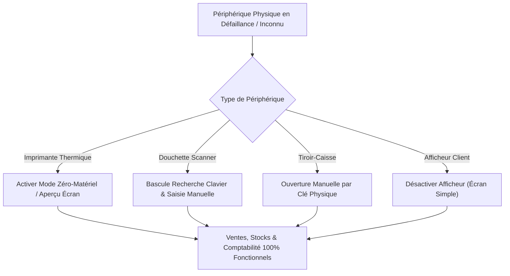

# JAZZ POS — Protocole de Réception Matérielle sur Site (Onsite Acceptance)

**Document de Procédure Opérateur & Liste de Contrôle Déploiement Caisse**  
**Date d'audit :** 06 Septembre 2026  
**Version de l'application :** JAZZ POS 1.0.0+1 (Architecture Multi-Périphériques v2)  
**Classification Globale :** **VERIFICATION SUR SITE OBLIGATOIRE (ONSITE VALIDATION REQUIRED)**  
**Durée estimée :** 15 à 20 minutes en caisse  

---

## Directives d'Exécution pour le Technicien Déployeur

> [!IMPORTANT]
> **Règle d'or de sécurité financière :**
> JAZZ POS découple strictement la transaction comptable (SQLite avec atomicité immédiate) des transmissions matérielles. Même si une imprimante se déconnecte, brûle son fusible ou bourre son papier, **la vente, le stock et le paiement demeurent intègres**. Ne tentez jamais de modifier la base de données manuellement sur le terminal du client.

Ce protocole pas-à-pas doit être exécuté par le technicien JAZZ POS directement devant le terminal point de vente du commerçant avant toute mise en exploitation réelle.

---

## Procédure de Réception en 23 Étapes

| Étape | Action Opérateur & Condition de Succès | Statut | Remarques / Constat Terrain |
| :---: | :--- | :---: | :--- |
| **01** | **Installation de JAZZ POS** Exécuter l'installateur `JAZZ-POS-Setup-x64.exe` avec privilèges Administrateur. Vérifier la création de l'icône sur le bureau et le démarrage automatique sans erreur DLL. | [ ] PASS [ ] FAIL | Répertoire d'installation vérifié (`C:\Program Files\JAZZ POS`). |
| **02** | **Exécution du Scan Environnement** Accéder à *Paramètres > Diagnostic Système*. Vérifier que l'OS détecté est Windows 10/11 x64, que le chemin `%APPDATA%\JazzPOS` est accessible en écriture, et que l'intégrité SQLite affiche `SAIN (OK)`. | [ ] PASS [ ] FAIL | Si Windows 7/8 est détecté, vérifier que l'écran d'alerte non-destructif s'affiche sans bloquer de données. |
| **03** | **Création de la Sauvegarde Initiale** Dans *Paramètres > Sauvegardes*, cliquer sur *« Créer une sauvegarde immédiate »*. Vérifier qu'un fichier snapshot timestampé `.db` non vide est généré et copié sur clé USB de secours. | [ ] PASS [ ] FAIL | Emplacement : `%APPDATA%\JazzPOS\backups`. |
| **04** | **Lancement de l'Auto-Scan Matériel** Dans l'assistant matériel, cliquer sur *« Scanner le matériel »*. Vérifier que la recherche inspecte le Spooler Windows, les ports COM, et les écrans secondaires sans planter l'application. | [ ] PASS [ ] FAIL | Durée du scan constatée (< 2 secondes). |
| **05** | **Vérification de l'Imprimante Recommandée** Contrôler le candidat présélectionné par l'algorithme `PrinterScorer`. Vérifier qu'aucune imprimante virtuelle (*Microsoft Print to PDF, XPS, OneNote, Fax*) n'est sélectionnée. | [ ] PASS [ ] FAIL | Nom de l'imprimante POS détectée : ____________________ |
| **06** | **Impression du Ticket de Test** Cliquer sur *« Imprimer un ticket de test »*. Vérifier que l'imprimante thermique s'active et émet le ticket d'étalonnage. | [ ] PASS [ ] FAIL | Profil sélectionné : `POSBANK` / `EPSON ESC/POS` / `Générique 80mm`. |
| **07** | **Vérification de la Largeur Papier (80mm / 58mm)** Mesurer le rouleau thermique. Vérifier que la mise en page s'ajuste parfaitement sans tronquer le texte à droite ni provoquer de retour à la ligne anarchique. | [ ] PASS [ ] FAIL | Largeur réelle constatée : [ ] 80 mm &nbsp; [ ] 58 mm |
| **08** | **Vérification Typographique du Français** Contrôler la netteté des caractères accentués français (*é, è, à, ç, ê*) sur le ticket imprimé. | [ ] PASS [ ] FAIL | Absence de caractères corrompus (pas de symboles chinois/hiéroglyphes). |
| **09** | **Vérification Typographique de l'Arabe (RTL)** Contrôler le rendu du nom du magasin ou de l'en-tête fiscal en arabe. Vérifier la liaison correcte des lettres arabes cursives et le sens de lecture droite-à-gauche. | [ ] PASS [ ] FAIL | Rendu assuré via le rasteriseur graphique 1-bit autonome `ReceiptRasterizer`. |
| **10** | **Vérification du Format Monétaire TND (3 Décimales)** Contrôler que tous les montants monétaires apparaissent avec exactement trois décimales (*ex: 45.500 TND*, *0.700 TND*), sans inversion de chiffres. | [ ] PASS [ ] FAIL | Séparateur décimal et millimes conformes aux normes comptables tunisiennes. |
| **11** | **Vérification de la Lisibilité du Code-Barres / QR** Prendre la douchette code-barres et flasher le code-barres ou le QR Code imprimé au bas du ticket de caisse. | [ ] PASS [ ] FAIL | La douchette lit instantanément la référence du ticket. |
| **12** | **Vérification du Massicot Automatique (Cutter)** Contrôler que la commande de coupe partielle (ou totale) s'exécute immédiatement en fin d'impression du ticket sans bloquer le papier. | [ ] PASS [ ] FAIL | Commande `GS V 66 0` ou `GS V 0` prise en charge par le matériel. |
| **13** | **Test d'Éjection du Tiroir-Caisse** Cliquer sur le bouton *« Tester le tiroir-caisse »*. Vérifier que l'impulsion électrique (port RJ11 imprimante ou port Série dédié) provoque l'ouverture physique du tiroir. | [ ] PASS [ ] FAIL | Impulsion `ESC p 0 25 250` validée. Vérifier la position de la clé physique du tiroir. |
| **14** | **Test de la Douchette Code-Barres (USB HID)** Sur l'écran de vente, scanner un article en rayon. Vérifier que la chaîne de caractères est capturée en rafale (< 80 ms/caractère) et ajoutée au panier sans intervention clavier. | [ ] PASS [ ] FAIL | Modèle de douchette : ____________________ (Vérifier absence de double scan). |
| **15** | **Réalisation d'une Vente Complète Réelle** Encaisser un article avec paiement en espèces (*100.000 TND avec rendu monnaie*). Vérifier l'ouverture du tiroir, l'impression du ticket, et l'enregistrement de la vente. | [ ] PASS [ ] FAIL | Numéro de ticket généré : ____________________ |
| **16** | **Test de Panne Imprimante Déconnectée** Débrancher le câble USB ou l'alimentation de l'imprimante thermique. | [ ] PASS [ ] FAIL | L'imprimante passe hors-ligne. |
| **17** | **Exécution d'une Vente avec Imprimante Hors-Ligne** Réaliser une nouvelle vente au comptant alors que l'imprimante est totalement éteinte ou débranchée. | [ ] PASS [ ] FAIL | L'application ne plante pas, ne fige pas et n'annule pas la saisie. |
| **18** | **Vérification de Survie de la Vente (Zéro Perte)** Vérifier que : 1. La vente est bien enregistrée dans le journal des ventes. 2. Le stock a bien été décrémenté. 3. Une boîte de dialogue propose la réimpression ou l'aperçu écran sans perte financière. | [ ] PASS [ ] FAIL | **CRITIQUE :** La comptabilité et le stock sont 100% justes malgré l'échec d'impression. |
| **19** | **Reconnexion de l'Imprimante Thermique** Rebrancher le câble USB ou rallumer l'imprimante. Attendre 3 secondes pour la détection Windows. | [ ] PASS [ ] FAIL | Statut périphérique repasse à `OPÉRATIONNEL` ou `PRÊT`. |
| **20** | **Réimpression du Ticket Historique** Ouvrir l'historique des ventes, sélectionner la vente effectuée en mode dégradé, et cliquer sur *« Réimprimer »*. Vérifier que le ticket sort avec la mention explicite `*** DUPLICATA ***`. | [ ] PASS [ ] FAIL | Vérifier qu'aucun mouvement de stock ou doublon de vente n'a été créé. |
| **21** | **Redémarrage Complet de JAZZ POS** Fermer l'application JAZZ POS et la relancer à partir de l'icône du bureau. | [ ] PASS [ ] FAIL | Temps de démarrage constaté : _____ secondes. |
| **22** | **Contrôle de Persistance de la Configuration** Vérifier que les périphériques configurés (imprimante, profil 80mm, tiroir, douchette) sont immédiatement reconnectés sans repasser par l'assistant. | [ ] PASS [ ] FAIL | Configuration chargée depuis `%APPDATA%\JazzPOS\config.json`. |
| **23** | **Création de la Sauvegarde Finale Pré-Exploitation** Créer une seconde sauvegarde propre avant de céder le terminal au commerçant. Exporter le rapport technique de déploiement via *« Exporter le rapport d'audit »*. | [ ] PASS [ ] FAIL | Rapport horodaté et copie de sécurité archivée sur clé USB externe. |

---

## Procédure de Repli d'Urgence sur Site (Emergency Fallback)

Si le terminal du client présente un matériel incompatible, non reconnu ou défectueux (ex: imprimante chinoise sans pilote Windows, port COM défaillant, tiroir grippé), **l'installation commerciale ne doit en aucun cas être annulée ou bloquée**.

Appliquer immédiatement le protocole de dégradation maîtrisée suivant :

### 1. Défaillance Imprimante : Activation du Mode Zéro-Matériel (Preview Mode)
* Ouvrir *Paramètres > Matériel > Imprimante de Caisse*.
* Sélectionner **« Imprimante Virtuelle / Aperçu Écran »** (`PreviewPrinter` ou `FakeReceiptPrinter`).
* **Comportement en caisse :** À chaque encaissement, le ticket fiscal apparaît instantanément dans une fenêtre modale d'aperçu haute fidélité. Le caissier peut valider la transaction, montrer le total à l'acheteur, ou imprimer ultérieurement.
* **Intégrité financière :** Strictement identique. Toutes les écritures comptables, taxes et mouvements de stock sont enregistrés avec la même rigueur.

### 2. Défaillance Scanner : Saisie Assistée & Recherche Rapide
* Si la douchette USB ne transmet pas les codes ou est absente :
  * Utiliser le raccourci global `F2` ou cliquer sur la barre de recherche du catalogue.
  * La caissière tape les 3 premières lettres du vêtement ou saisit manuellement les chiffres du code-barres au pavé numérique puis appuie sur `Entrée`.
  * La sélection par tuile tactile dans la grille de catégories demeure pleinement opérationnelle.

### 3. Défaillance Tiroir-Caisse : Exploitation Manuelle
* Désactiver la commande d'ouverture dans *Paramètres > Matériel > Tiroir-Caisse* (`DisabledCashDrawer`).
* Remettre la clé physique du tiroir au commerçant pour ouverture manuelle à chaque transaction en espèces.
* L'équilibrage de caisse lors de la clôture de shift (`Rapport Z`) reste parfaitement calculé au millime près.

### 4. Défaillance Afficheur Client
* Positionner l'afficheur client sur **« Désactivé »** (`DisabledCustomerDisplay`).
* Le flux d'encaissement principal n'est soumis à aucune latence d'attente d'E/S série.

---

## Signature & Validation de Clôture Déploiement

* **Nom du Commerçant / Boutique :** ____________________________________________________
* **Adresse / Localisation :** ____________________________________________________________
* **Nom du Technicien Déployeur :** _____________________________________________________
* **Date & Heure d'achèvement :** _______________________________________________________
* **Décision Finale de Mise en Service :**  
  [ ] **DÉPLOIEMENT COMPLET VALIDÉ (Tous périphériques opérationnels)**  
  [ ] **DÉPLOIEMENT SOUS MODE DÉGRADÉ MAÎTRISÉ (Repli Zéro-Matériel documenté ci-dessus)**  

*Signature du Technicien :* &nbsp;&nbsp;&nbsp;&nbsp;&nbsp;&nbsp;&nbsp;&nbsp;&nbsp;&nbsp;&nbsp;&nbsp;&nbsp;&nbsp;&nbsp;&nbsp;&nbsp;&nbsp;&nbsp;&nbsp;&nbsp;&nbsp;&nbsp;&nbsp;&nbsp;&nbsp;&nbsp;&nbsp;&nbsp;&nbsp;&nbsp;&nbsp;&nbsp;&nbsp;&nbsp;&nbsp; *Signature & Cachet du Client :*
